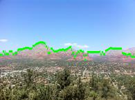
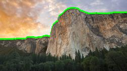

# CS B551 Assignment 2: Games and Bayes

 The Horizon detection makes use of Bayes Nets and the Viterbi Algorithm.

## Part 2

### Horizon finding

The underlying theme for the problem statement defined in Part 2 requires the use of Bayes Net for finding the Horizon of sample images. An image, which can be seen as a matrix of rows and columns has an image gradient at each cell. Keeping this mind, we 
must estimate the most fitting row value for each column in the image pixels. The gradient data becomes our observed values which are the vectorized column values and 
the row data is the hidden variables value at each point.

###  Problem Subset 1
s∗i = arg max P(Si = si|w1, ..., wm)
In this part we simply pick the maximum edge strength in each column. Using variable elimination we find that the the pixel only depends on the column it is present in.

###  Problem Subset 2

This subset uses the Viterbi ALgorithm to find an optimal solution or rathe rmsot likely sequence for a set of given states. The Viterbi function taken in the follwing: 
The initial probability which is 1, the emmission probabilites and the transition probabilities.
In this case we try to maximize the posterior. The posterior is given as:
P(S1 = s1, ..., Sm = sm|w1, ..., wm) = P(w1, ..., w = wm|S1..., sm=Sm) * P(S+1|S) * (W0) //Normalizing factor

Since the denominator is same for all states we only maximise the numerator.
Maximising a function or log of the function is the same thing. Here we are maximising log posterior.
hence, LOG P(S1 = s1, ..., Sm = sm|w1, ..., wm) =Π LOG P(Wn|sn) + Π LOG P(S+1|S) + log(W0)

-Emission : For each column,  for each row (Pixel strength/Σpixel strength)
-Transition : The transition probability from one state to other state only depends on the previous column. The transition probability is high when row difference is less between the columns and low if row difference is high. Thus as we iterate through the column list, values nearby have a higher probaliblity of converging as the maximum value of the transition function.The key concept behind this strategy is that horizon is always smooth and hence we dont want any jumps between the rows. 
The probability we made is no. of rows-row_difference / no. of rows. 
This probability satisfies Σtransition prob = 1 as it is also normalised and is consisitent with the logic stated above. 
Choice value = log(Initial Probability) + log(Transition Probability) + log(Emmision Probability) 
The choice of our path depends on the maximum value received through taking the choice value of every column,we pick the larger of the  competing values and record the higher probability path.
Thus for any point N, we consider the most startegic path or rather maximum probavilty upto path N-1.

###  Problem Subset 3 
The third problem statement asserts the need of human intervention for feedback. We can execute this function by carrying out a bidirectional search Viterbi Algorithm. 
This means that the viterbi algorithm runs for the given input row and column position and visits the neighbouring elements on either of its sides. This strategic approach ensures we append the max array value which is at a specific distance from the given feedback.

We have given coordinates which lie on horizon as input and we run bidirectional viterbi. For example the coordinates are 78,7 the forward pass runs from 8 to last column and the backward pass runs from 6 to column0. We store the output of both and add in one array. The output of backward pass needs to be reversed before combining. We then put pixel on the combined output.

## References
1. https://news.ycombinator.com/item?id=7381082
2. http://cs229.stanford.edu/proj2016/report/NieHouAn-AIPlays2048-report.pdf
3. http://blog.datumbox.com/using-artificial-intelligence-to-solve-the-2048-game-java-code/
4. http://artent.net/2014/04/07/an-ai-for-2048-part-4-evaluation-functions/

