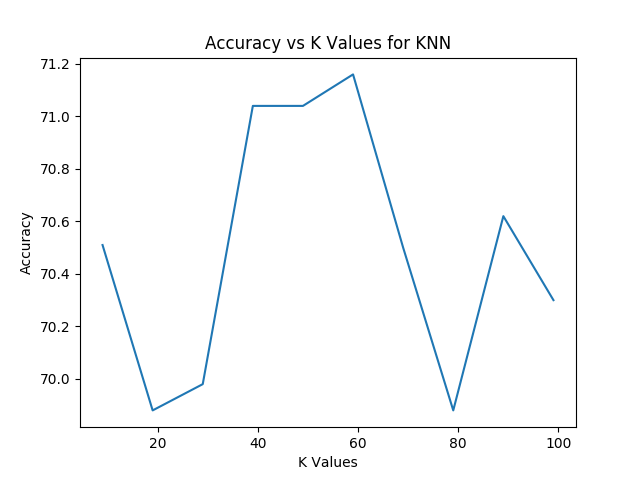
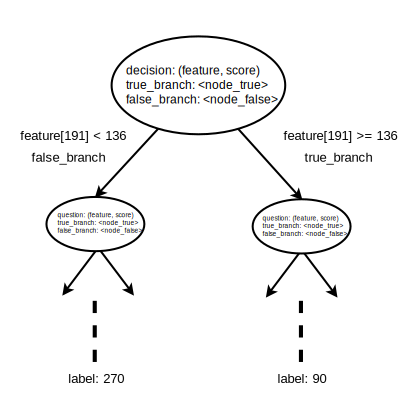
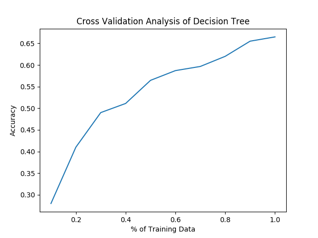
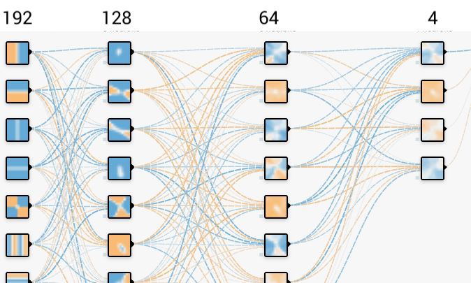
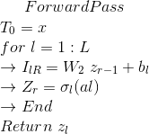
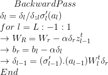
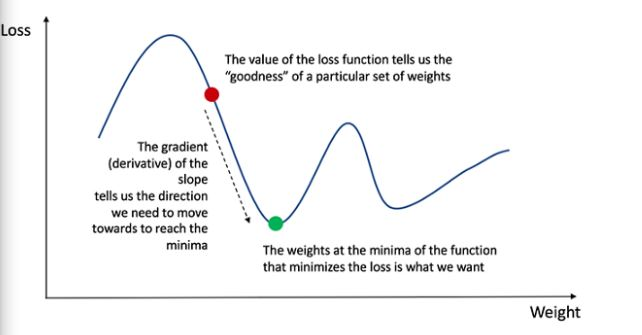
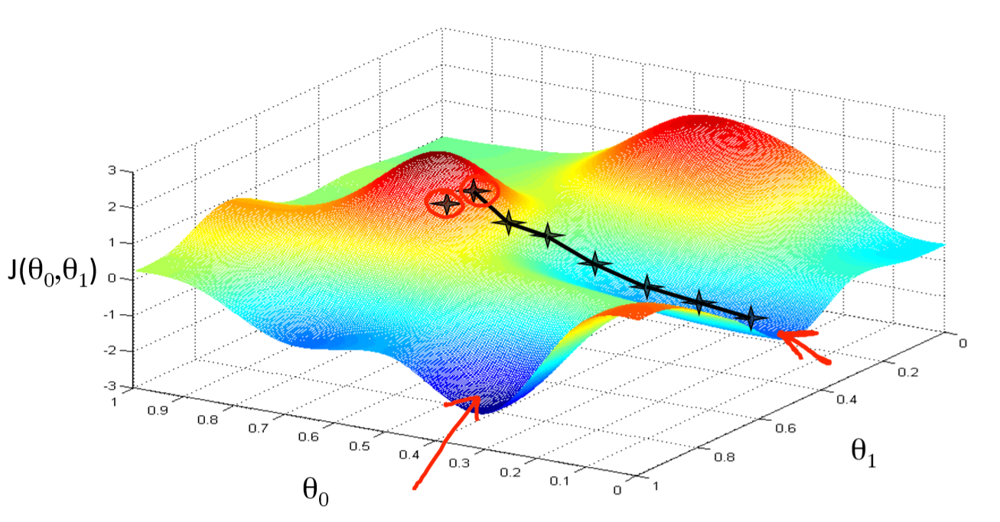
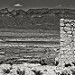

# B551 Assignment 4: Machine learning
The goal of this assignment was to implement three classifiers, namely - 
_k-nearest neighbors_, _neural networks_, and _decision tree_, for classifying images
based on its orientation. The images can be classified into 4 orientations - 0,
90, 180, 270.

## K-Nearest Neighbors

This problem subset includes using the training and testing data-set to classify images using K nearest Neighbors. The generic algorithm for K nearest Neighbors is :
We assign the image tuple to the class most common amongst K nearest Neighbors. 
KNN works on the methodology of finding distances between each row of test data set with every row of the training data and setting its class label as the value of the minimum Euclidian distance. We set the minimum distance value of the neighbor to each of the testing data sets. For eg, for K=1 we assign the label value to the class label of its Nearest neighbor. 


### Process
A few design decisions we took along the way:

#### Value of K: An odd value for K so that we can rule out the probability of getting equal order of choices for selection of class label. The value of K should also not be a multiple of number of classes. We took values of K ranging from 9 to 101 with a hop count of 10. This method Kernel Method: We implemented the Kernel method algorithm in order to compute the Euclidean distance for every row in the testing dataset. The kernel methodology is a computationally cheaper way of analyzing multiple coordinates and calculating the distance value. This is an implicit methodology carried out so that coordinates and their calculation is seldom done in space. We consider the transpose of our row G^(t) since (a-b)^2 = a^2 + b^2 - 2ab In a more schematic way this we consider :

``` 
 x1 =  Testing data Image row
 x2 = Transpose Testing data Image row
 z1 = Training data Image row
 z2 = Training data Image row
 distance = (x1* transpose(x2)) + (z1* transpose(z2)) - 2*(x1, transpose(z2))

```
Thus, instead of a 1* 192 matrix we make a 192*1 matrix for storing all nearest distances. Count is the total no of labels inherently the same to the labels in the testing data. Accuracy = estimated labels/(len(labels)) ** 100 Which will give us the accuracy of our classification model We can do this for K number of Neighbors.

### Challenges and Assumptions
 
The value of K had to be adjusted inorder to settle on a good accuracy in an acceptable time period. 
Thus, we considered the following values. 

### Results 
| K Value      | Accuracy       | Time (in seconds) |
| :---:        |     :---:      |     :---:       |
| 9            | 70.51%          | 110.266      |
| 19           | 69.88%          | 228.66           |
| 29           | 69.98%          | 339.94     |
| 39           | 71.05%          | 460.90     |
| 49           | 71.04%          | 772.04     |
|59            | 71.15%          | 1058.03     |
| 69           | 70.50%          | 1377.06     |
| 79           | 69.88%          | 1685.05     |
| 89           | 70.62%          | 2043.56     |
| 99           | 70.30%          | 2361.81     |

We projected these data points graphically just to see the most efficient K Value 

<p align="center">  </p>

We can see that K= 39 gives the best accuracy and time efficiency. Thus the rest of the code is based of K_Value =39

K nearest neighbours does not take any training data as such into account. Thus it gives an average accuracy for the same. 


## Decision Tree
This section of the report describes the way in which Decision Tree Learning was
used  to classify images based on their orientation. It uses a tree-like structure
that depicts nodes, possible consequences from a node and different cost functions.
The type of decision tree used here is called **CART (Classification and Regression Trees).**

Below are some of the terminologies used in decision trees,
1. **Decision Node**: Nodes in the decision tree where the tree splits off into different
branches. This can be a root node, internal node or leaf node.
2. **Branch**: Part of the sub-tree that starts off from a node.
3. **Leaf**: The very last node of the tree, which does not split is called a Leaf. It
contains one of the the class labels that we are classifying.
4. **Impurity**: Measure of how often a data point is incorrectly labeled.
5. **Information** Gain: The amount of information that is contained by a node. 
6. **Partition**: The process of splitting up of the tree into two branches based 
certain features and threshold values.

A brief extraction of the decision tree structure is shown in the figure below,

<!--  -->
<p align="center">

</p>


The code is divided into two structures - one for training and the other for testing. 

### Training

The process of training of the model is described below.

#### 1. Input Values

The input values are read from the *train-data.txt* file, and converted to a vector
of length 193. The first 192 values are the pixel values of the features and the 
last value is the class that the image is labeled with. Therefore, each vector has
the following structure,
```
[r11, b11, g11, r12 ......., label]
```

#### 2. Process

The process of training starts off by calling the function **make_decision_tree()**,
by passing the training data matrix. *make_decision_tree()* is a recursive function
that recursively builds the *true branch* and the *false branch*. It first finds the
best partitioning criteria, by calling the function *get_best_decision()*, by 
passing the data-set. This goes through every vector and every feature in a vector,
to determine the best decision that would split the data-set. This is done by certain
metrics that are defined below,

1. **Gini Impurity:** This gives a measure of how frequently the given data is 
incorrectly labeled. It is calculated
by adding up the squares of the probability of a data point with a label that has 
been incorrectly categorized, which is subtracted from 1, as the minimum can be 
zero when all the features have fallen into the same category.It can be written as, 
[1]
```text
       len(label)
Gini = 1 - ∑ (label(i)/len(data))^2
          i=1
```


2. **Information Gain**: This is the measure of how much information that is contained
by node. It is denoted by a term called Entropy, which is the degree
of disorder in the particular tree/subtree. It is calculated by subtracting the 
entropy of the children nodes from the parent node. It can be written as, [1]

```text
                                          len(label)                                             len(label) 
Info Gain = Entropy(Parent) - P(false_data) * ∑ (label(i)/len(false_data))^2 - (1 - P(false_data)) * ∑ (label(i)/len(true_data))^2 
                                             i=1                                                    i=1 
```

The algorithm keeps a track of the best decision to split the data, based on 
gain that is the maximum, as that tells us that, that particular node has a better
chance of classifying the image. The function returns the best splitting criteria, 
and the maximum gain, which is then used to split the data into the *true branches*
and *false branches*. True branches contain data that is more pure, in the sense that
it has many data points that have the same class label. On the other hand, false branches
contain data that has mixed class labels, and is relatively impure.

The base case of the function is when the gain is 0, which means that the branch
has reached a leaf. So it returns the current classified label. At the end of the 
recursion, the function return the root node, that contains links to all other nodes
through its branches. The node has 3 members,
* **decision**: Tuple that stores the feature (b11, r23 etc), and the threshold value.
* **false_branch**: Reference to the node that is at the root of the false subtree.
* **true_branch**: Reference to the node that is the root of the true subtree. 


#### 3. Analysis

For the training data-set in *train-data.txt* with about 36,000 images, the training 
time is about 4 hrs. The model of the decision tree is saved onto the file **tree_model.txt**.

### Testing

The process of testing of the model is described below.

#### Input Values


The input values are read from the *test-data.txt* file, and converted to a vector
of length 193. The first 192 values are the pixel values of the features and the 
last value is the class that the image is labeled with. Therefore, each vector has
the following structure,
```
[r11, b11, g11, r12 ......., label]
```

#### Process

The process of testing is relatively simple. The testing algorithm loops through 
every image, and it just calls the function *decide_labels()*, by passing the image
vector and the decision tree model. The function traverses the tree by checking the scores
of every feature till it reaches a Leaf. When it does so, it return the label that is 
present in that particular node. The classified images are stores onto a file called
*output.txt*.

The model is also tested using *k-Fold Cross-Validation*. Here, there are 10 folds
that splits the training data-set.

#### Analysis

The accuracy on the testing data is **66.49%**. Below is a graph that depicts the result 
of cross validation.

<p align="center">

</p>

## Neural Network

This section of the report describes the way in which Neural Networks  was used to classify images based on their orientation. . A set of computing algorithms inspired by the structure and design of the biological neural network,Neural Networks can be used to classify data. 

Neural networks are great function approximations , neural networks learn the feature space along with the main function as opposed to the kernel methods. The activation we are using to approximate is sigmoid and the ouput of final layer is softmax.

#### Our network [9]:
<p align="center">  </p>

We have 4 layers:
1. Input layer with 192 nodes
2. 1st hidden layer with 128 nodes
3. 2nd hidden layer with 64 nodes
4. Output layer with 4 nodes

#### Initialising Weight and Bias:
Weights and bias are initialised as  np.transpose(np.random.randn(n_inputs+1,n_hidden1) * np.sqrt(2/n_hidden1)). This representsa normal distribution with mean 0. the values are small and close to zeros.


#### Why layers? What does it do?
As said above, neural networks are function approximaters and the number nodes define the no. of functions that will approximate the objective loss. Having more layers allows to approximate complex functions really really well. The basic idea is , the first layer will approximate the function in some way and the next layer will use the approximation of the first layer as a unit and approximate the objective function. The third layer combines multiple of these non linear functions to even more non linear functions in order to approximate.

#### Why Neural networks.?
As data increases the accuracy in kernel methods asymptotes and doesnt increase much with more data ,also it becomes computationally expensive. Thats not the case with neaural network, since in nn we lean the feature space and we can do better and better with data.
Below are some of the terminologies used in Neural Networks,

### Training

1. **Feed forward**: 
In the feed-forward part of a neural network, predictions are made based on the values in the input nodes and the weights.

   Step 1: (Calculate the dot product between inputs and weights)
We do this in a vectorised form i.e matrix multiplications.

   Step 2: (Pass the result from step 1 through an activation function)
The result from Step 1 can be a set of any values. However, in our output we have the values in the form of 1 and 0. We want our output to be in the same format. To do so we need an activation function, which squashes input values between 1 and 0. Here we use the sigmoid function.
Other Functions: ReLu(rectified linear units, most widely used nowadays) implemented relu but incorrectly and hence stuck with sigmoid , tanh(hyperbolic tangent)

   Step 3: Output of neural network
Here we use the softmax function as activation for the final layer.

<p align="center">


</p>

2. **Back Propagation**: 
The output of the nueral network(step 3 in feed forward) is our final output. Now we try to adjust the weight and bias such that we get minimum error. Neural network is an optimization problem (as all of machine learning can be viewed as optimization problems) where we try to minimize the loss by varying weights and biases. [10]

<p align="center">  </p>

This is a loss function in 1 dimension. This is hardly the case as we have more dimensions. And our loss may look like this:[11]

<p align="center">  </p>


Methods for minimizing or optimising:

1. Good old batch gradient descent(which we are using)

   In Batch Gradient Descent, all the training data is taken into consideration to take a single step. We take the average of the gradients of all the training examples and then use that mean gradient to update our parameters. So that’s just one step of gradient descent in one epoch.
Batch Gradient Descent is great for convex or relatively smooth error manifolds. In this case, we move somewhat directly towards an optimum solution.
Issues: Often gets stuck in local minima.
Tackling that issue: In order to get out of small local minima we set the learning rate and number of epoch high so that it wil only get stuck in lower miminmas.
Still not the best one. Tried stochastic , didn't work :(

2. Stochastic gradient descent(  works well in practice) 

   SGD is very noisy. However this turns out to be a crucial feature to avoid local minima and saddle points.

3. In Stochastic Gradient Descent (SGD)

   We consider just one example at a time to take a single step. We do the following steps in one epoch for SGD:
  
    1. Take an example
    
    2. Feed it to Neural Network
    
    3. Calculate it’s gradient
    
    4. Use the gradient we calculated in step 3 to update the weights
    
    5. Repeat steps 1–4 for all the examples in training data-set
 
#### Analysis

The weights and bias are outputted in a file called _nnet_model.txt_.
The predicted labels are in file ouput.txt.

The best train accuracy is **82.3%** for settings:

* Learning rate : **0.05**
* Number epochs : **1760** 
* Test accuracy: **71.3%**


## Conclusion

Below are the results that have been obtained by running the above mentioned classifiers
on the data in the *test-data.txt*.

| Classifier      | Accuracy       | 
| :---:        |     :---:      |
| K-Nearest Neighbor         | 71.05%          | 
| Neural Network           | 70.31%          | 
| Decision Tree          | 66.49%          |

With the above stated accuracies, below are some images that have been incorrectly 
classified by our classifiers.

#### 1. K-Nearest Neighbors

Original: 0, Classified: 180           |  Original: 90, Classified: 180   
:-------------------------:|:-------------------------:
  |  


#### 2. Neural Network

Original: 270, Classified: 0           |  Original: 270, Classified: 180   
:-------------------------:|:-------------------------:
  |  

 
#### 3. Decision Tree

Original: 0, Classified: 180           |  Original: 270, Classified: 180   
:-------------------------:|:-------------------------:
  |  


## References

1. https://en.wikipedia.org/wiki/Decision_tree_learning#Gini_impurity
2. http://www.cs.cornell.edu/courses/cs4780/2018fa/lectures/lecturenote20.pdf
3. https://towardsdatascience.com/batch-mini-batch-stochastic-gradient-descent-7a62ecba642a
4. https://stackabuse.com/creating-a-neural-network-from-scratch-in-python-multi-class-classification/
5. https://medium.com/greyatom/decision-trees-a-simple-way-to-visualize-a-decision-dc506a403aeb
6. https://www.saedsayad.com/decision_tree.htm
7. https://machinelearningmastery.com/k-fold-cross-validation/
8. https://github.com/danielpang/decision-trees/blob/master/learn.py
9. https://playground.tensorflow.org/#activation=tanh&batchSize=10&dataset=circle&regDataset=reg-plane&learningRate=0.03&regularizationRate=0&noise=0&networkShape=4,2&seed=0.81542&showTestData=false&discretize=false&percTrainData=50&x=true&y=true&xTimesY=false&xSquared=false&ySquared=false&cosX=false&sinX=false&cosY=false&sinY=false&collectStats=false&problem=classification&initZero=false&hideText=false
10. https://towardsdatascience.com/how-to-build-your-own-neural-network-from-scratch-in-python-68998a08e4f6
11. https://hackernoon.com/gradient-descent-aynk-7cbe95a778da

